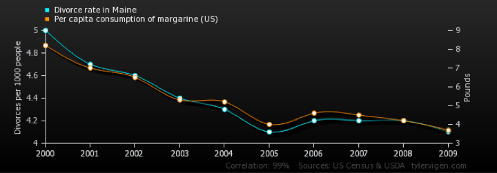
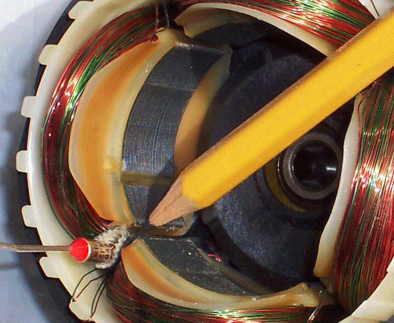
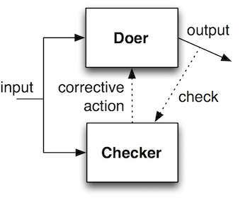
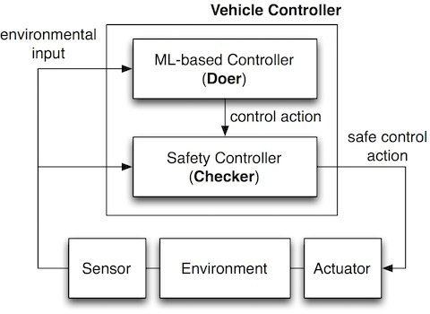
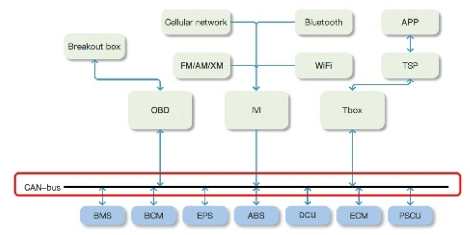
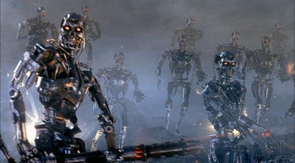
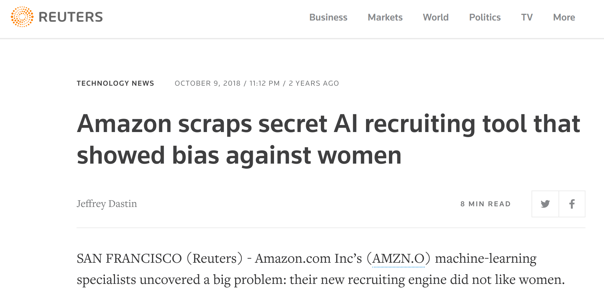
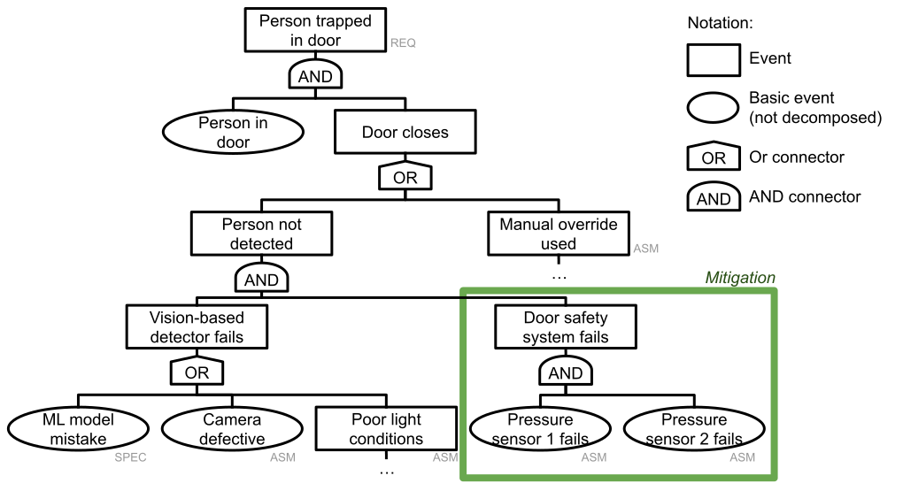
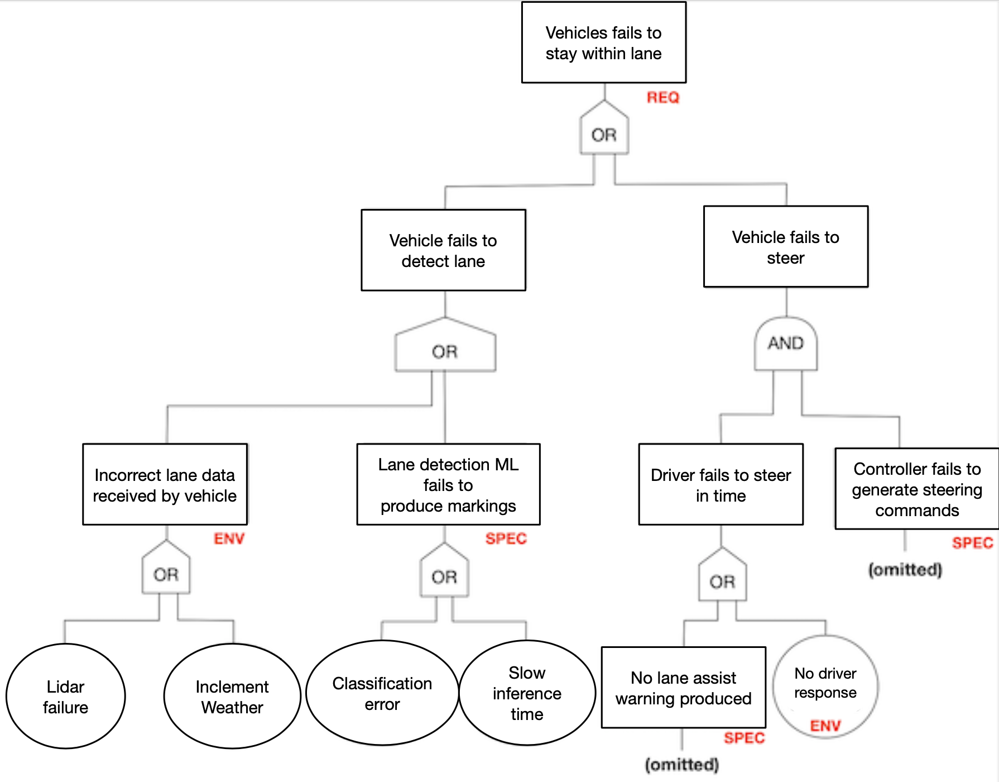
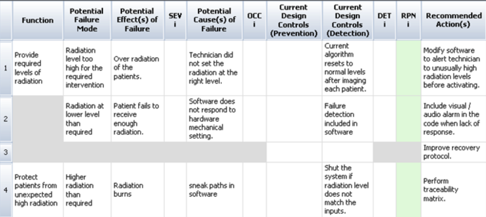

## Exploring Requirements...

<!-- .element: class="plain stretch" -->

----
## Learning goals:

* Consider ML models as unreliable components
* Use safety engineering techniques FTA, FMEA, and HAZOP to anticipate and analyze possible mistakes 
* Design strategies for mitigating the risks of failures due to ML mistakes

----
## Readings

Required reading: 🕮 Hulten, Geoff. "Building Intelligent Systems: A
Guide to Machine Learning Engineering." (2018), Chapters 6–7 (Why
creating IE is hard, balancing IE) and 24 (Dealing with mistakes)

---
# ML Models = Unreliable Components

----
## Models make mistakes

<!-- .element: class="stretch" -->

----
## Models make mistakes

----
## Common excuse: Software mistake -- nobody's fault

----
## Common excuse: Just software mistake

----
## Common excuse: The problem is just data

<!-- .element: class="stretch" -->

----
## Common excuse: Nobody could have foreseen this...

----
## What responsibility do designers have to anticipate problems?

----
## Sources of Wrong Predictions?

<!-- discussion -->

----
## Correlation vs Causation

----
## Confounding Variables

<!-- .element: class="plain" -->

----
## Hidden Confounds

<!-- .element: class="plain stretch" -->

Confounding variables that are not evident in the data

Note: ML algorithms may pick up on things that do not relate to the task but correlate with the outcome or hidden human inputs. For example, in cancer prediction, ML models have picked up on the kind of scanner used, learning that mobile scanners were used for particularly sick patients who could not be moved to the large installed scanners in a different part of the hospital.

----
## Reverse Causality

<!-- .element: class="plain stretch" -->

* Model infers a causal relationship in the wrong direction
* Sacrifice the queen -> win games?

Note: (from Prediction Machines, Chapter 6) Early 1980s chess  program learned from Grandmaster games, learned that sacrificing queen would be a winning move, because it was occuring frequently in winning games. Program then started to sacrifice queen early.

----
## Reverse Causality

<!-- .element: class="plain stretch" -->

* Higher prices -> higher demand?

Note: (from Prediction Machines, Chapter 6) Low hotel prices in low sales season. Model might predict that high prices lead to higher demand.

----
## Missing Counterfactuals

<!-- .element: class="plain stretch" -->

* Data does not capture what would've happened under different conditions

Note: Training data often does not indicate what would have happened with different situations, thus identifying causation is hard

----
## Other Issues

* Insufficient training data
* Noisy training data
* Biased training data
* Overfitting
* Poor model fit, poor model selection, poor hyperparameters
* Missing context, missing important features
* Noisy inputs
* "Out of distribution" inputs

----
## Mistakes are usually not random

Unlike physical processes -- e.g. probability of steel axle breaking

Model fails repeatedly for same input

Independent models may make same mistake

Systematic problems possible, e.g., fairness bias

Attackers can induce mistakes (adversarial inputs)

----
## ML Models make crazy mistakes

Humans often make predicable mistakes
  * most mistakes near to correct answer, distribution of mistakes

ML models may be wildly wrong when they are wrong
   - especially black box models may use (spurious) correlations humans would never think about
   - may be very confident about wrong answer
   - "fixing" one mistake may cause others

----
## Living with ML mistakes

No model is every "correct"

Some mistakes are unavoidable

Anticipate the eventual mistake
* Make the system safe despite mistakes
* Consider the rest of the system (software + environment)
* Example: Thermal fuse in smart toaster

**ML model = unreliable component**

---
# Designing for Mistakes

----
## Bollards mitigate mistakes

----
## Bollards mitigate mistakes

----
## Bollards mitigate mistakes

----
## Many different strategies

Based on *fault-tolerant design*, assuming that there will be software/ML mistakes or environment changes violating assumptions

We will cover today:
* Human in the loop
* Undoable actions
* Guardrails
* Mistake detection and recovery (monitoring, doer-checker, fail-over, redundancy)
* Containment and isolation

----
## Today's Running Example: Autonomous Train

<!-- colstart -->

<!-- .element: class="stretch" -->

CC BY 2.0 by Matt Brown

<!-- col -->
* REQ: The train shall not collide with obstacles
* REQ: The train shall not depart until all doors are closed
* REQ: The train shall not trap people between the doors
* ...

<!-- colend -->

Note: The Docklands Light Railway system in London has operated trains without a driver since 1987. Many modern public transportation systems use increasingly sophisticated automation, including the Paris Métro Line 14 and the Copenhagen Metro

----
## Human-AI Interaction Design (Human in the Loop)

Recall:

* Automate: Take an action on user's behalf
* Prompt: Ask the user if an action should be taken
* Organize, annotate, or augment: Add information to a display
* Or hybrid of these

----
## Human in the Loop

* AI and humans are good at predictions in different settings
  * AI better at statistics at scale and many factors
  * Humans understand context and data generation process; often better with thin data 
* AI for prediction, human for judgment?
* But be aware of:
  * Notification fatigue, complacency, just following predictions; see *Tesla autopilot*
  * Compliance/liability protection only?
* Deciding when and how to interact
* Lots of UI design and HCI problems

Notes: Cancer prediction, sentencing + recidivism, Tesla autopilot, military "kill" decisions, Powerpoint design suggestions

----
## Human in the Loop - Examples

* Email response suggestions

* Fall detection smartwatch
* Safe browsing

----
## Human in the Loop - Examples?

<!-- .element: class="stretch" -->

<!-- references_ -->

CC BY 2.0 by Matt Brown

----
## Undoable actions

* Automating only actions that can be undone
* Design system to make actions undoable
* Designing a process to appeal decisions

**Examples?**

----
## Undoable actions - Examples

<!-- .element: class="stretch" -->

* Override thermostat setting
* Powerpoint design suggestions
* 1-Click shopping with free return shipment
* Appeal process for banned "spammers" or "bots"
* Easy to repair bumpers on autonomous vehicles?

<!-- img: https://unsplash.com/photos/RFAHj4tI37Y -->

----
## Undoable actions - Examples?

<!-- .element: class="stretch" -->

<!-- references_ -->

CC BY 2.0 by Matt Brown

----
## Guardrails

* Post-process ML predictions before taking actions
* Limit/truncate predictions to safe thresholds
* Manual overrides for certain values
* Backup models for known problematic conditions
* Hardware protections

Ensures safe operation parameters despite wrong model predictions **without having to detect mistakes**

----
## Guardrails - Examples

Recall: Thermal fuse in smart toaster

<!-- .element: class="stretch" -->

+ maximum toasting time + extra heat sensor

<!-- ---- -->
<!-- ## Guardrails -->

<!--  -->

<!-- **What guardrails may be appropriate?** -->

----
## Guardrails - Examples

<!-- .element: class="stretch" -->

Censoring in audio transcriptions

----
## Guardrails - Examples?

<!-- .element: class="stretch" -->

<!-- references_ -->

CC BY 2.0 by Matt Brown

----
## Guardrails - Examples

<!-- .element: class="stretch" -->

<!-- references_ -->

CC BY-SA 4.0 by Chabe01

----
## Mistake detection and recovery

Design a recovery mechanism if mistakes are detectable, directly or indirectly

Requires (1) a detection mechanism (e.g., external monitor, redundancy) and
(2) a response

<!-- .element: class="stretch" -->

----
## Mistake detection

An independent mechanism to detect problems (in the real world)

Example: Gyrosensor to detect a train taking a turn too fast

<!-- .element: class="stretch" -->

----
## Mistake detection -- many strategies

* Detect sensor failures with diagnostics
* Detect sensor failures with redundancies
* Monitor software for crashes
* Monitor for expected environmental conditions
  - e.g., proper lighting of security camera footage
* Check the outcome of an action against expectation
  - e.g., Vehicle accelerating, human clicking on something

**Examples in autonomous train scenario?**

Note:

Independent sensor: Vision system sees no obstacle, but door sensor reports resistance

Redundant sensor: Two cameras report significantly different images

Broken sensor: No image, black image, white noise from camera

----
## Doer-Checker Example: AV

<!-- colstart -->

<!-- .element: class="stretch" -->

<!-- col -->

* ML-based controller (doer): Generate commands to steer the vehicle
  * Complex DNN; makes performance-optimal control decisions
* Safety controller (checker): Checks commands from ML controller; overrides it
  with a safe default command if the ML action is risky
  * Simpler, based on verifiable, transparent logic; conservative control

<!-- colend -->
----
## Doer-Checker Example: AV

<!-- .element: class="stretch" -->

* Yellow region: Slippery road, ignored by ML -> Causes loss of traction
* Checker: Monitor detects lane departure; overrides ML with a
  safe steering command

<!-- references_ -->
_Runtime-Safety-Guided Policy Repair_, Zhou et al., Intl. Conference on Runtime Verification (2020)

----
## Graceful Degradation (Fail-safe)

<video>
    <source data-src="rc-car.mp4" type="video/mp4" />
</video>

* Goal: When a component failure is detected, achieve system 
  safety by reducing functionality and performance
* Switches operating mode when failure detected (e.g., slower, conservative)

----
## Redundancy

Useful for problem detection *and* response
* Redundant sensors
* Redundant models/subsystems
  - Hot Standby: Standby watches & takes over when primary fails
  - Voting: Select the majority decision

<!-- .element: class="stretch" -->

Challenge: Software + models are rarely really independent

----
## Redundancy Example: Sensor Fusion

<!-- .element: class="stretch" -->

* Combine data from a wide range of sensors
* Provides partial information even when some sensor is faulty
* A critical part of modern self-driving vehicles

----
## Containment: Decoupling & Isolation

**Design principle**: Faults in a low-critical (LC) components should not impact
  high-critical (HC) components

Example: Do not connect fly-by-wire software with plane's entertainment system

**Example in autonomous train?**

----
## Poor Decoupling: USS Yorktown (1997)

<!-- .element: class="stretch" -->

* Invalid data entered into DB; divide-by-zero crashes entire network
* Required rebooting the whole system; ship dead in water for 3h
* Lesson: Handle expected component faults; prevent propagation

----
## Poor Decoupling: Automotive Security

<!-- .element: class="stretch" -->

* Main components connected through a common CAN bus
  * Broadcast; no access control (anyone can read/write)
* Can control brake/engine by playing a malicious MP3

<!-- references_ -->
_Experimental Security Analysis of a Modern Automobile_, Koscher et al., (2010)

----
## Containment: Decoupling & Isolation

* **Design principle**: Faults in a low-critical (LC) components should not impact
high-critical (HC) components
* Apply the principle of *least privilege*
  * LC components should have minimal necessary access
* Limit interactions across criticality boundaries
  * Deploy LC & HC components on different networks
  * Add monitors/checks at interfaces
* Is an ML component in my system performing an LC or HC task?
  * If HC, can we "demote" it into LC?
  * Alternatively, if possible, replace/augment HC ML components with
  non-ML ones

----
## Design Strategies Summary

Human in the loop

Undoable actions

Guardrails

Mistake detection and recovery (monitoring, doer-checker, fail-over, redundancy)

Containment and isolation

<!-- ---- -->
<!-- ## Short Breakout -->

<!-- What design strategies would you consider to mitigate ML mistakes: -->
<!-- * Credit card fraud detection -->
<!-- * Image captioning for accessibility in photo sharing site -->
<!-- * Speed limiter for cars (with a vision system to detect traffic signs) -->

<!-- Consider: Human in the loop, Undoable actions, Guardrails, Mistake detection and recovery (monitoring, doer-checker, fail-over, redundancy), Containment and isolation -->

<!-- As a group, post one design idea for each scenario to `#lecture` and tag all group members. -->

---
# Risk Analysis

----
## What's the worst that could happen?

<!-- .element: style="width:800px" -->

<!-- references -->

*Likely?* Toby Ord predicts existential risk from GAI at 10% within 100 years:
Toby Ord, "The Precipice: Existential Risk and the Future of Humanity", 2020

Note: Discussion on existential risk. Toby Ord, Oxford philosopher predicts 

----

<!-- .element: class="stretch" -->

----
## What's the worst that could happen?

<!-- .element: class="stretch" -->

----
## What's the worst that could happen?

<!-- .element: class="stretch" -->

----
## What's the worst that could happen?

<!-- .element: class="stretch" -->

----
## What's the worst that could happen?

<!-- .element: class="stretch" -->

----
## What's the worst that could happen?

<!-- .element: class="stretch" -->

----
## What is Risk Analysis?

What can possibly go wrong in my system, and what are potential 
impacts on system requirements?

Risk = Likelihood * Impact

A number of methods:
  * Failure mode & effects analysis (FMEA)
  * Hazard analysis
  * Why-because analysis
  * Fault tree analysis (FTA)
  * ...

---
# Fault Tree Analysis

----
## Fault Tree Analysis (FTA)

<!-- colstart -->

* Fault tree: A top-down diagram that displays the relationships
between a system failure (i.e., requirement violation) and its potential causes.  
  * Identify sequences of events that result in a failure
  * Prioritize the contributors leading to the failure
  * Inform decisions about how to (re-)design the system
  * Investigate an accident & identify the root cause 
* Often used for safety & reliability, but can also be used for
other types of requirements (e.g., poor performance, security attacks...)

<!-- col -->

<!-- .element: style="width:400px" -->

<!-- colend -->
----
## Fault Tree Analysis & ML

* ML is increasingly used in safety-critical domains such as automotive, aeronautics, industrial control systems, etc.,
* ML models are just one part of the system
* ML models will EVENTUALLY make mistakes
  * Output wrong predictions/values
  * Fail to adapt to the changing environment
  * Confuse users, etc.,
* How do mistakes made by ML contribute to system failures? How do we
  ensure their mistakes do not result in a catastrophic outcome?

----
## Fault Trees: Basic Building Blocks

<!-- .element: class="stretch" -->

Event: An occurrence of a fault or an undesirable action
  * (Intermediate) Event: Explained in terms of other events
  * Basic Event: No further development or breakdown; leaf

Gate: Logical relationship between an event & its immediate subevents
  * AND: All of the sub-events must take place
  * OR: Any one of the sub-events may result in the parent event

----
## Fault Tree Example

<!-- .element: class="stretch" -->

* Every tree begins with a TOP event (typically a violation of a requirement)
* Every branch of the tree must terminate with a basic event

<!-- references_ -->
Figure from _Fault Tree Analysis and Reliability Block Diagram_
(2016), Jaroslav Menčík. 

----
## Analysis: What can we do with fault trees?

1. Qualitative analysis: Determine potential root causes of a
    failure through _minimal cut set analysis_

2. Quantitative analysis: Compute the probability of a failure

----
## Minimal Cut Set Analysis

<!-- colstart -->

*Cut set:* A set of basic events whose simultaneous occurrence is
  sufficient to guarantee that the TOP event occurs.

*Minimal cut set:* A cut set from which a smaller cut set can't be
obtained by removing a basic event.

<!-- col -->

<!-- .element: class="stretch" -->

**What are minimal cut sets here?**

<!-- colend -->

----
## Failure Probability Analysis

To compute the probability of the top event:
  * Assign probabilities to basic events (based on domain knowledge)
  * Apply probability theory to compute probabilities of intermediate events
	through AND & OR gates
  * (Alternatively, as sum of prob. of minimal cut sets) 

In this class, we won't ask you to do this.
  * Why is this especially challenging for software? 

----
## FTA Process

1. Specify the system structure
   * Environment entities & machine components
   * Assumptions (ASM) & specifications (SPEC)
2. Identify the top event as a requirement violation (REQ)
3. Construct the fault tree
	* Derive intermediate events from a violation of ENV or SPEC
	* Decompose the intermediate events further down based on the knowledge of the domain or components
4. Analyze the tree, Identify all possible minimal cut sets
5. Consider design modifications
   * Eliminate certain cutsets, or
   * Increase the size of min cutsets
6. Repeat

----
## Example: Autonomous Train

<!-- .element: class="stretch" -->

<!-- references_ -->

CC BY 2.0 by Matt Brown

Note: The Docklands Light Railway system in London has operated trains without a driver since 1987. Many modern public transportation systems use increasingly sophisticated automation, including the Paris Métro Line 14 and the Copenhagen Metro

----
## Example: Autonomous Train

* REQ: The train shall not depart until all doors are closed
* REQ: The train shall not trap people between the doors

Solution combines a vision-based system identifying people in the door with pressure sensors and a manual override.

**Using a fault tree identify possible problems that could lead to *trapping a person in the door*.**
  * Hint: What assumptions and specifications might be violated?

----

----
## Consider Mitigations

* Remove basic events with mitigations
* Increase the size of cut sets with mitigations

<!-- .element: class="stretch" -->

----

----
## One more example: FTA for Lane Assist

* REQ: The vehicle must be prevented from veering off the lane.
* SPEC: Lane detector accurately identifies lane markings in the input image; 
  the controller generates correct steering commands
* ENV: Sensors are providing accurate information about the lane;
  driver responses when given warning; steering wheel is functional

Possible mitigations?

<!-- .element: class="stretch" -->

----
## FTA: Caveats

In general, building a **complete** tree is impossible
  * There are probably some faulty events that you missed
  * "Unknown unknowns"

Domain knowledge is crucial for improving coverage
  * Talk to domain experts; augment your tree as you learn more

FTA is still very valuable for risk reduction!
  * Forces you to think about & explicitly document possible failure scenarios
  * A good starting basis for designing mitigations

---
# FMEA

----
## Fault-Tree Analysis Discussion

* Town-down, *backward* search for the root cause of issues
    - from final outcomes to initiating events
* Issues (TOP events) need to be known upfront
* Quantitative analysis possible
* Useful for understanding faults post-hoc
* Where do outcomes come from?

----
## Failure Mode and Effects Analysis (FMEA)

<!-- .element: class="stretch" -->

* A __forward search__ technique to identify potential hazards
* Widely used in aeronautics, automotive, healthcare, food services,
  semiconductor processing, and (to some extent) software

----
## FMEA Process

(a) Identify system components

(b) Enumerate potential failure modes
  * *for ML component: Always suspect prediction may be wrong*

(c) For each failure mode, identify:
  * Potential hazardous effect on the system
  * Method for detecting the failure
  * Potential mitigation strategy

----
## FMEA Example: Autonomous Train Doors

<!-- discussion -->

Failure modes? Failure effects? Detection? Mitigation?

----
## Exercise: FMEA Analysis for Smart Toaster

(video sensor, temperature sensor, heat sensor, user setting, ML model, heuristic shutdown, thermal fuse)

Failure modes? Failure effects? Detection? Mitigation?

<!-- discussion -->

----
## FMEA Excerpt: Autonomous Car

<!-- references -->

Excerpt of an FMEA table for analyzing components in an autonomous vehicle, from 🗎 David Robert Beachum. Methods for assessing the safety of autonomous vehicles. University of Texas Theses and Dissertations (2019).

----
## "Wrong Prediction" as Failure Mode?

"Wrong prediction" is a very cause grained failure mode of every model

May not be possible to decompose further

However, may evaluate causes of wrong prediction for better understanding, as far as possible --> FTA?

----
## FMEA Summary

Forward analysis: From components to possible failures

Focus on single component failures, no interactions

Identifying failure modes may require domain understanding

---
# HAZOP

----
## Hazard and Interoperability Study (HAZOP)
   
*Identify hazards and component fault scenarios through guided inspection of requirements*

----
## Hazard and Operability Study (HAZOP)

<!-- colstart -->

A __forward search__ method to identify potential hazards

For each component, use a set of __guide words__ to generate
possible deviations from expected behavior

Consider the impact of each generated deviation: Can it result in a system-level hazard?

<!-- col -->

<!-- colend -->

----
## HAZOP Example: Emergency Braking (EB)

<!-- colstart -->

Specification: EB must apply a maximum braking command to the engine.

  * __NO OR NOT__: EB does not generate any braking command.
  * __LESS__: EB applies less than max. braking.
  * __LATE__: EB applies max. braking but after a delay of 2
  seconds.
  * __REVERSE__: EB generates an acceleration command instead of braking.
  * __BEFORE__: EB applies max. braking before a possible crash is detected.

<!-- col -->

<!-- colend -->

----
## HAZOP & ML

In addition to traditional analysis:
Analyze possible mistakes of all ML components

Original guidewords:
NO OR NOT,
MORE,
LESS,
AS WELL AS,
PART OF,
REVERSE,
OTHER THAN / INSTEAD,
EARLY,
LATE,
BEFORE,
AFTER

Additional ML-specific guidewords: WRONG, INVALID, INCOMPLETE, PERTURBED, and INCAPABLE.

----
## Breakout: Automated Train Doors

Analyze the vision component to detect obstacles in train doors

NO OR NOT,
MORE,
LESS,
AS WELL AS,
PART OF,
REVERSE,
OTHER THAN / INSTEAD,
EARLY,
LATE,
BEFORE,
AFTER, WRONG, INVALID, INCOMPLETE, PERTURBED, and INCAPABLE.

Using HAZOP: As a group answer in `#lecture`, tagging group members:

> * What is the specification of the perception component? 
> * What are possible deviations from the specification?
> * What are potential hazards resulting from these deviations?
> * What possible mitigations would you consider? (e.g., human in the loop, undoable actions, guardrails, mistake detection and recovery, containment)

----
## HAZOP: Benefits & Limitations

* Easy to use; encourages systematic reasoning about component faults
* Can be combined with FTA/FMEA to generate faults (i.e., basic
events in FTA)
* Potentially labor-intensive; relies on engineer's judgement
* Does not guarantee to find all hazards (but also true for other techniques)

----
## Remarks: Hazard Analysis

None of these methods guarantee completeness
  * You may still be missing important hazards, failure modes

Intended as structured approaches to thinking about failures
  * But cannot replace human expertise and experience

---
# Summary

* Accept that a failure is inevitable
  * ML components will eventually make mistakes, reasons barely matter
  * Environment may evolve over time, violating assumptions
* Design strategies for mitigating mistakes
  * Human in the loop, Undoable actions, Guardrails, Mistake detection and recovery (monitoring, doer-checker, fail-over, redundancy), Containment and isolation
* Use risk analysis to identify and mitigate potential problems
  - FTA, FMEA, HAZOP

----
## Further readings

* 🕮 Google PAIR. People + AI Guidebook. 2019, especially chapters “Errors + Graceful Failure” and “Mental Models.”
* 🗎 Martelaro, Nikolas, Carol J. Smith, and Tamara Zilovic. “Exploring Opportunities in Usable Hazard Analysis Processes for AI Engineering.” In AAAI Spring Symposium Series Workshop on AI Engineering: Creating Scalable, Human-Centered and Robust AI Systems (2022).
* 🗎 Qi, Yi, Philippa Ryan Conmy, Wei Huang, Xingyu Zhao, and Xiaowei Huang. “A Hierarchical HAZOP-Like Safety Analysis for Learning-Enabled Systems.” In AISafety2022 Workshop at IJCAI2022 (2022).
* 🗎 Beachum, David Robert. “Methods for assessing the safety of autonomous vehicles.” MSc thesis, 2019.
*  🗎 Amershi, Saleema, Dan Weld, Mihaela Vorvoreanu, Adam Fourney, Besmira Nushi, Penny Collisson, Jina Suh et al. “Guidelines for human-AI interaction.” In Proceedings of the 2019 CHI Conference on Human Factors in Computing Systems, 2019.
*  🗎 Shneiderman, Ben. “Bridging the gap between ethics and practice: Guidelines for reliable, safe, and trustworthy Human-Centered AI systems.” ACM Transactions on Interactive Intelligent Systems (TiiS) 10, no. 4 (2020): 1–31.

