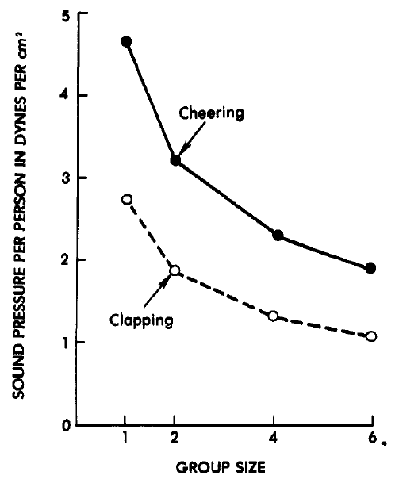

<!-- .element: class="titleslide"  data-background="../_chapterimg/03a_teamwork.jpg" -->

## Machine Learning in Production

# Navigating Conflicts in (Student) Teams

<!-- image: https://pixabay.com/photos/team-grass-cheer-field-game-sport-2444978/ -->

---
# Assigned Seating

1. Find your team number
2. Find a seat in the range for your team
3. Introduce yourself to the other team members

----
## Now: First Short Team Meeting (10 min)

* Move to table with your team number
* Say hi, introduce yourself: Name? SE or ML background? Favorite movie? Fun fact?
* Find time for first team meeting in next few days
* Agree on primary communication until team meeting
* Pick a movie-related team name, post team name and tag all group members on slack in `#social`

---
## Teamwork is crosscutting...

<!-- .element: class="plain stretch" -->

----
## Teams are Inevitable

1. Projects too large to build for a single person (division of work)
2. Projects too large to fully comprehend by a single person (divide and conquer)
3. Projects need too many skills for a single person to master (division of expertise)

----
## Interdisciplinary Teams are Inevitable

<!-- .element: class="stretch" -->

----
## The Importance of Teamwork Skills

Virtually all software projects are done in teams

ML-enabled projects need to bring together different backgrounds

Good teams make it fun to work together

Learn from each other

Limited influence in selecting/firing team members in most organizations

Peer performance evaluations common in industry (e.g. [Google's Process](https://www.performyard.com/articles/googles-performance-management-playbook))

----
## Who has had bad experiences in teams? Student teams? Teams in industry?

<!-- .element: class="plain" style="width:70%" -->

---
# Team issues: Groupthink

----
## Groupthink

* Group minimizing conflict
* Avoid exploring alternatives
* Suppressing dissenting views
* Isolating from outside influences
* -> Irrational/dysfunctional decision making

----
## Example: Time and Cost Estimation

<!-- discussion -->

----
## Example: Use of Hype Technology

(agile, block chain, machine learning, devops, AIOps, ...)

<!-- discussion -->

----
## Causes of Groupthink

* High group cohesiveness, homogeneity
* Structural faults (insulation,  biased leadership, lack of methodological exploration)
* Situational context (stressful external threats, recent failures, moral dilemmas)

----
## Symptoms

* Overestimation of ability: invulnerability, unquestioned believe in morality
* Closed-mindedness: ignore warnings, stereotyping; innovation averse
* Pressure toward uniformity: self-censorship, illusion of unanimity, …
----
<!-- .element: style="width:950px" -->

----
## Diversity

> “Men and women have different viewpoints, ideas, and market insights, which enables better **problem solving**. A gender-diverse workforce provides easier **access to resources**, such as various sources of credit, multiple sources of information, and wider industry knowledge. A gender-diverse workforce allows the company to serve an **increasingly diverse customer base**. Gender diversity helps companies **attract and retain talented women**.”

> “Cultural diversity leads to **process losses** through task conflict and decreased social integration, but to process gains through increased creativity and satisfaction.”

<!-- references -->

* Stahl, Günter K., et al. "[Unraveling the effects of cultural diversity in teams: A meta-analysis of research on multicultural work groups](http://leeds-faculty.colorado.edu/dahe7472/Stahl%202009.pdf)." Journal of international business studies 41.4 (2010): 690-709.
* Sangeeta Badal. [The Business Benefits of Gender Diversity](http://www.gallup.com/businessjournal/166220/business-benefits-gender-diversity.aspx). Gallup, 2014

----
## Groupthink and AI

* Need of AI
* Selection of learning method
* Narrow view of fairness
* Missing safety requirements
* Ignoring ethics

----
## Mitigation Strategies

<!-- discussion -->

----
## Mitigation Strategies

* Diversity in team composition
* Culture of open conflicts
* Appoint devil's advocate in discussions, moderate and rotate speaker order, leaders hide opinions in discussions
* Involve outside experts
* Always request a second solution
* Monitoring and process measurement
* Agile techniques as planning poker, on-site customer

---
# Team issues: Social loafing

----

<!-- .element: class="stretch plain" -->

<!-- references_ -->

Latane, Bibb, Kipling Williams, and Stephen Harkins. "[Many hands make light the work: The causes and consequences of social loafing.](http://web.mit.edu/curhan/www/docs/Articles/15341_Readings/Group_Dynamics/required_reading/4Latane_et_al_1979_Many_hands_make_light_the_work.pdf)" Journal of personality and social psychology 37.6 (1979): 822.

----
## Social Loafing

* People exerting less effort within a group
* Reasons
    * Diffusion of responsibility
    * Motivation
    * Dispensability of effort / missing recognition
    * Avoid pulling everybody / "sucker effect"
    * Submaximal goal setting
* “Evaluation potential, expectations of co-worker performance, task meaningfulness, and culture had especially strong influence”

<!-- references -->

Karau, Steven J., and Kipling D. Williams. "[Social loafing: A meta-analytic review and theoretical integration](https://www1.psych.purdue.edu/~willia55/392F-%2706/KarauWilliamsMetaAnalysisJPSP.pdf)." Journal of personality and social psychology 65.4 (1993): 681.

----
## Mitigation Strategies

<!-- discussion -->

----
<!-- colstart -->
## Motivation 

Autonomy

Mastery 

Purpose

<!-- col -->

<!-- .element: class="stretch" -->
<!-- colend -->

----
## Mitigation Strategies

* Involve all team members, colocation
* Assign specific tasks with individual responsibility
    * Increase identifiability
    * Team contracts, measurement
* Provide choices in selecting tasks
* Promote involvement, challenge developers
* Reviews and feedback
* Team cohesion, team forming exercises
* Small teams

----
## Responsibilities & Buy-In

* Involve team members in decision making
* Assign responsibilities (ideally goals not tasks)
* Record decisions and commitments; make record available

---
# Debugging Teamwork in Student Teams

----
## Who has had bad experiences in teams? Student teams? Teams in industry?

<!-- .element: class="plain" style="width:70%" -->

----
## Some past complaints

* "M. was very pleasant and would contribute while in meetings.  Outside of them, he did not complete the work he said he would and did not reach out to provide an update that he was unable to.  When asked, on the night the assignment was due, he completed a portion of the task he said he would after I had completed the rest of it."
* "Procrastinated with the work till the last minute - otherwise ok."
* "He is not doing his work on time. And didnt check his own responsibilities. Left work undone for the next time." 
* "D. failed to catch the latest 2 meetings. Along the commit history, he merely committed 4 and the 3 earliest commits are some setups. And the latest one commits is to add his name on the meeting log, for which we almost finished when he joined."
* "Unprepared with his deliverables, very unresponsive on WhatsApp recently, and just overall being a bad team player."
* "Consistently failed to meet deadlines. Communication improved over the course of the milestone but needed repeated prompts to get things done. Did not ask for help despite multiple offers."

----
## Common Frustrations in Student Teams

No visible progress until last minute

Late work

Incomplete or low quality solutions at integration

Unresponsive team members

Passive, uninterested team members without initiative

Needs lots of reminding and help

**Sources?**

----
## Common Sources of Frustrations

* Priority differences ("10-601 is killing me, I need to work on that first", "I have dance class tonight")
* Ambition differences ("a B- is enough for graduating")
* Ability differences ("incompetent" students on teams)
* Working style differences (deadline driven vs planner)
* Communication preferences differences (avoid distraction vs always on)
* In-team competition around grades (outdoing each other, adversarial peer grading)

<!-- references -->
Based on research and years of own experience 

----
## How would you handle...

> One team member has very little technical experience and is struggling with basic Python scripts and the Unix shell. It is faster for other team members to take over the task rather than helping them.

----
## How would you handle...

> You divide the work and but when you try to integrate on the evening before the deadline you learn that one team member has failed to complete their part. They tried the day before, but got stuck with a dependency problem.

----
## How would you handle...

> After last minute stress at the last assignment, you team agrees to start earlier and to integrate at a milestone days before the deadline to leave a buffer. Yet you see little progress from half the team in GitHub and hardly anybody responds in Slack. Little is done at the agreed milestone. The work gets done before the deadline, but with the same stress as in the last assignment.

----
## How would you handle...

> This homework is low priority for one team member. They rarely contribute beyond the bare minimum at the last minute.

----
## How would you handle...

> This homework is low priority for one team member. They rarely contribute beyond the bare minimum at the last minute.

> The rest of the team grudgingly compensates and achieves full points for the assignment. You do not feel comfortable criticizing the student as it may negatively affect their grade.

----
## Summary: How would you handle...

1. One team member has very little technical experience and is struggling with basic Python scripts and the Unix shell. It is faster for other team members to take over the task rather than helping them.
2. You divide the work and but when you try to integrate on the evening before the deadline you learn that one team member has failed to complete their part. They tried the day before, but got stuck with a dependency problem.
3. After last minute stress at the last assignment, you team agrees to start earlier and to integrate at a milestone days before the deadline to leave a buffer. Yet you see little progress from half the team in GitHub and hardly anybody responds in Slack. Little is done at the agreed milestone. The work gets done before the deadline, but with the same stress as in the last assignment.
4. This homework is low priority for one team member. They rarely contribute beyond the bare minimum at the last minute. (The rest of the team grudgingly compensates and achieves full points for the assignment. You do not feel comfortable criticizing the student as it may negatively affect their grade.)

----
## Breakout: Navigating Team Issues

Pick one or two of the scenarios (or another one team member faced in the past) and openly discuss proactive/reactive solutions

As a team, tagging team members, post to `#lecture`:

> 1. Brief problem description 
> 2. How to prevent in the first place
> 3. What to do when it occurs anyway

---
## Teamwork Policy in this Course

Teams can set their own priorities and policies – do what works for you, experiment
   * Not everybody will contribute equally to every assignment – that's okay
   * Team members have different strength and weaknesses – that's good

We will intervene in *team citizenship* issues!

> Golden rule: Try to do what you agreed to do by the time you agreed to. If you cannot, seek help and communicate clearly and early.

----
## Team Citizenship

* Be responsive and responsible
* Come to meetings on time, participate actively
* Stick to commitments, work on assigned tasks
* When problems, reach out, replan, communicate early, be proactive
* (Replanning and dealing with mistakes is normal)

We will adjust grades if complains about:
* Lack of communication
* Disrespectful or dismissive communication
* Not attending team meetings (without excuse)
* Blowing internal deadlines without communication
* Failing to complete agreed tasks without timely communication

----
## Peer Grading Process and Support

We are here to help! Teamwork is a learning goal

TA assigned as mentor to every team, reach out for support

Team citizenship survey after every milestone

Debriefing with TA after every milestone, discuss how it went and how to improve

Adjusting grades based on survey and communication with course staff

----
## Peer Grading Mechanics

* Survey with rating form and text field, explaining what the issue is
* We discard complains without explanation and those beyond team citizenship (e.g, regarding ability or effort)
* Will immediately adjust grade, forcing the issue in the team
    * See [form](https://ckaestne.github.io/seai/F2022/assignments/peergrading.html) to preview effects
    * Can lead to substantial grade adjustments (-10% to -50% common)
    * Instructors listen to appeals
* *If entire team agrees, this can be used to adjust grades for intentionally imbalanced contributions*
* Depending on severity, TAs will escalate to instructors

----
## Avoiding Adversarial Peer Grading

* Peer grading focuses only on team citizenship
* Comments are required for negative ratings and read by TAs and instructors
*
* *Avoid avoiding conflict:* Set high standards and give honest feedback *before* mounting frustration and spiraling problems

---
# Tips for Getting Started

----
## Establish Communication and Meeting Patterns

* Agree on how to communicate in the team: Email? Slack? Whatsapp?
* Agree on communication expectation. Different people have different habits and expectations. Be explicit!
    * Read emails daily? On weekends?
    * Respond to urgent chat messages within 3h? Read old chat messages?
    * Be available for chat during certain hours?
+ Find meeting times. Plan ahead or meeting as needed?
+ Set **intermediate internal deadline** for integration
+ Set realistic expectations:  All have other classes and distractions; communicate availability openly
+ **Write down expectations!**

----
## Some Communication Tips

* Focus full-group meetings on planning and reflection, meet in smaller groups for focused work
* Use Slack/chat deliberately
    - consider chat ephemeral, don't expect everybody to catch up on all old messages
    - separate social communication from work comm., urgent from not urgent
    - explicitly tag people if you need their input, enable notifications during "working hours"
    - discuss non-urgent, long-term things outside of chat associated with topic (issue tracker, Google doc, ...)
* Reserve time for socializing and celebrating success (bonus points!)

----
## Share the Work

* Team members have different strength and weaknesses – that's good
* Make use of individual strength of team members (split, pair up, help, ...)
* Usually somebody will take responsibility for team management tasks (e.g., schedule meetings, moderate, meeting notes, track work, reminders, check submission) or reporting
  * Team management is work too
  * Consider rotating

----
## Maintain Accountability

 
* **Write down explicit deliverables: *Who* does *what* by *when***
    - Be explicit about expected results, should be verifiable 
    - Track completion, check off when done
    - GitHub issues, Jira, Trello board, Miro, Google docs, Slack, ... – **single source of truth, with history tracking** (see next recitation)
* Complete deliverable list **during meeting**: everybody writes their own deliverables, others read all deliverables to check understanding
    - if not completed during meeting or team member not at meeting, email assignment after meeting to everybody; no objection within 24h counts as agreement with task assignment
* We will ask for evidence of this with the first milestone
* Consider sharing with teams' TA mentor

----
## Recall: Common Sources of Conflict

* Different team members have different working patterns and communication preferences
    - e.g., start early vs close to deadline; plan ahead vs try and error
    - e.g., react to every notification vs reduce distractions, read email once a day
    - **discuss and set explicit expectations; talk about conflicts**
* Different abilities, unexpected difficulties
    - work in pairs, plan time for rework and integration
    - replan, contribute to teams in different ways
    - **work around it, it's the team's responsibility**
* Unreliable team members, poor team citizenship
    - e.g., not starting the work in agreed time, not responding, not attending
    - have written clear deliverables with deadlines
    - **talk about it within team, talk to course staff, peer grading**

---
# Summary

* Teamwork is unavoidable, teams rarely fully self-selected, good teams are fun
* Teamwork is hard, skills to be learned
* Many well known teamwork issues, including groupthink and social loafing
* Set explicit expectations for communication and work allocation
* We focus on team citizenship and apply peer grading

----
## Further Readings

* Mantle, Mickey W., and Ron Lichty. Managing the unmanageable: rules, tools, and insights for managing software people and teams. Addison-Wesley Professional, 2019.
* DeMarco, Tom, and Tim Lister. Peopleware: productive projects and teams. Addison-Wesley, 2013.
* Brooks Jr, Frederick P. The mythical man-month: essays on software engineering. Pearson Education, 1995.
* Classic work on team dysfunctions: Lencioni, Patrick. “The five dysfunctions of a team: A Leadership Fable.” Jossey-Bass (2002).
* Oakley, Barbara, Richard M. Felder, Rebecca Brent, and Imad Elhajj. "[Turning student groups into effective teams](https://norcalbiostat.github.io/MATH456/notes/Effective-Teams.pdf)." Journal of student centered learning 2, no. 1 (2004): 9-34.

