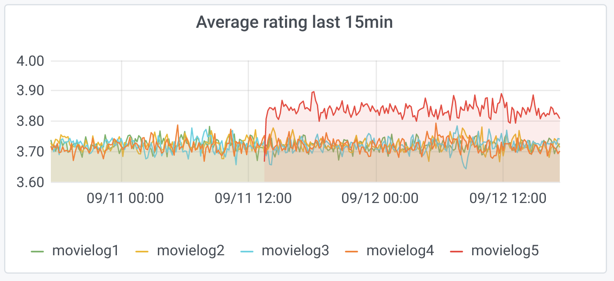
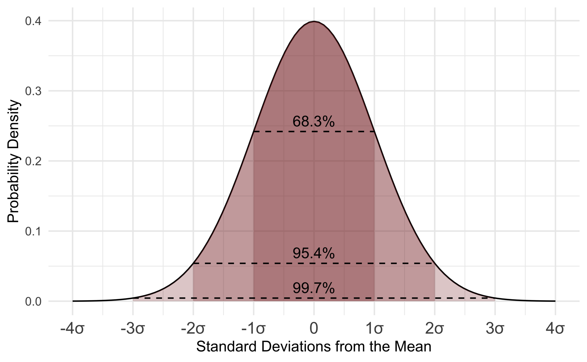
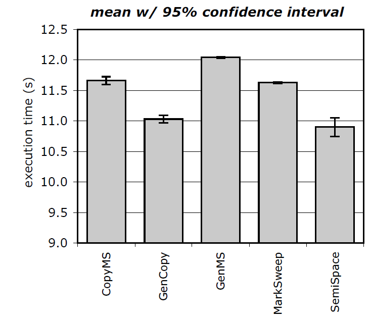

<div class="tweet" data-src="https://twitter.com/changelog/status/1137359428632621060"></div>


---
## Back to QA...


<!-- .element: class="plain stretch" -->


----
## Learning Goals

* Design telemetry for evaluation in practice
* Understand the rationale for beta tests and chaos experiments
* Plan and execute experiments (chaos, A/B, shadow releases, ...) in production
* Conduct and evaluate multiple concurrent A/B tests in a system
* Perform canary releases
* Examine experimental results with statistical rigor
* Support data scientists with monitoring platforms providing insights from production data

----
## Readings


Required Reading: 
* Hulten, Geoff. "[Building Intelligent Systems: A Guide to Machine Learning Engineering.](https://www.buildingintelligentsystems.com/)" Apress, 2018, Chapters 14 and 15 (Intelligence Management and Intelligent Telemetry).

Suggested Readings: 
* Alec Warner and Štěpán Davidovič. "[Canary Releases](https://landing.google.com/sre/workbook/chapters/canarying-releases/)." in [The Site Reliability Workbook](https://landing.google.com/sre/books/), O'Reilly 2018
* Kohavi, Ron, Diane Tang, and Ya Xu. "[Trustworthy Online Controlled Experiments: A Practical Guide to A/B Testing](https://bookshop.org/books/trustworthy-online-controlled-experiments-a-practical-guide-to-a-b-testing/9781108724265)." Cambridge University Press, 2020.


---
# From Unit Tests to Testing in Production

*(in traditional software systems)*

----
## Unit Test, Integration Tests, System Tests

<!-- .element: class="plain" style="width:1200px" -->

Note: Testing before release. Manual or automated.

----
## Beta Testing


<!-- .element: class="stretch" -->

Note: Early release to select users, asking them to send feedback or report issues. No telemetry in early days.

----
## Crash Telemetry

<!-- .element: style="width:900px" -->

Note: With internet availability, send crash reports home to identify problems "in production". Most ML-based systems are online in some form and allow telemetry. 

----
## A/B Testing

<!-- .element:  style="width:1200px" -->

Notes: Usage observable online, telemetry allows testing in production.  Picture source: https://www.designforfounders.com/ab-testing-examples/

----
## Chaos Experiments


[](https://en.wikipedia.org/wiki/Chaos_engineering)
<!-- .element: class="stretch" -->

Note: Deliberate introduction of faults in production to test robustness.


---
# Model Assessment in Production

Ultimate held-out evaluation data: Unseen real user data

----
## Limitations of Offline Model Evaluation

Training and test data drawn from the same population 
* **i.i.d.: independent and identically distributed**
* leakage and overfitting problems quite common

Is the population representative of production data?

If not or only partially or not anymore: Does the model generalize beyond training data?


----
## Identify Feedback Mechanism in Production 

Live observation in the running system

Potentially on subpopulation (A/B testing)

Need telemetry to evaluate quality -- challenges:
- Gather feedback without being intrusive (i.e., labeling outcomes), without harming user experience
- Manage amount of data
- Isolating feedback for specific ML component + version

----
## Discuss how to collect feedback

* Was the house price predicted correctly?
* Did the profanity filter remove the right blog comments?
* Was there cancer in the image?
* Was a Spotify playlist good?
* Was the ranking of search results good?
* Was the weather prediction good?
* Was the translation correct?
* Did the self-driving car break at the right moment? Did it detect the pedestriants?

<!-- discussion -->

Notes: More:
* SmartHome: Does it automatically turn of the lights/lock the doors/close the window at the right time?
* Profanity filter: Does it block the right blog comments?
* News website: Does it pick the headline alternative that attracts a user’s attention most?
* Autonomous vehicles: Does it detect pedestrians in the street?


----

<!-- colstart -->

<!-- col -->

<!-- colend -->

Notes:
Expect only sparse feedback and expect negative feedback over-proportionally

----
<!-- .element:  style="width:840px" -->

Notes: Can just wait 7 days to see actual outcome for all predictions
----
<!-- .element:  style="width:1100px" -->

Notes: Clever UI design allows users to edit transcripts. UI already highlights low-confidence words, can 

----
## Manually Label Production Samples

Similar to labeling learning and testing data, have human annotators


----
## Summary: Telemetry Strategies

* Wait and see
* Ask users
* Manual/crowd-source labeling, shadow execution
* Allow users to complain
* Observe user reaction


----
## Breakout: Design Telemetry in Production

Discuss how to collect telemetry (Wait and see, ask users, manual/crowd-source labeling, shadow execution, allow users to complain, observe user reaction)

Scenarios:
* Front-left: Amazon: Shopping app feature that detects the shoe brand from photos
* Front-right: Google: Tagging uploaded photos with friends' names
* Back-left: Spotify: Recommended personalized playlists
* Back-right: Wordpress: Profanity filter to moderate blog posts

(no need to post in slack yet)


----
## Measuring Model Quality with Telemetry

<div class="smallish">

* Usual 3 steps: (1) Metric, (2) data collection (telemetry), (3) operationalization
* Telemetry can provide insights for correctness
    - sometimes very accurate labels for real unseen data
    - sometimes only mistakes
    - sometimes delayed
    - often just samples
    - often just weak proxies for correctness
* Often sufficient to *approximate* precision/recall or other model-quality measures
* Mismatch to (static) evaluation set may indicate stale or unrepresentative data
* Trend analysis can provide insights even for inaccurate proxy measures
</div>

----
## Breakout: Design Telemetry in Production

<div class="smallish">

Discuss how to collect telemetry, the metric to monitor, and how to operationalize

Scenarios:
* Front-left: Amazon: Shopping app detects the shoe brand from photos
* Front-right: Google: Tagging uploaded photos with friends' names
* Back-left: Spotify: Recommended personalized playlists
* Back-right: Wordpress: Profanity filter to moderate blog posts

As a group post to `#lecture` and tag team members:
> * Quality metric:
> * Data to collect:
> * Operationalization:

</div>

----
## Monitoring Model Quality in Production

* Monitor model quality together with other quality attributes (e.g., uptime, response time, load)
* Set up automatic alerts when model quality drops
* Watch for jumps after releases
    - roll back after negative jump
* Watch for slow degradation
    - Stale models, data drift, feedback loops, adversaries
* Debug common or important problems
    - Monitor characteristics of requests 
    - Mistakes uniform across populations?
    - Challenging problems -> refine training, add regression tests

----
<!-- .element:  style="width:1200px" -->

----
## Prometheus and Grafana

[](https://prometheus.io/docs/introduction/overview/)
<!-- .element:  class="stretch" -->

----

<!-- .element:  class="stretch" -->

----
## Many commercial solutions

[](https://www.datarobot.com/platform/mlops/)
<!-- .element:  class="stretch" -->

<!-- references_ -->
e.g. https://www.datarobot.com/platform/mlops/

Many pointers: Ori Cohen "[Monitor! Stop Being A Blind Data-Scientist.](https://towardsdatascience.com/monitor-stop-being-a-blind-data-scientist-ac915286075f)" Blog 2019


----
## Detecting Drift

<!-- .element:  style="width:1000px" -->

<!-- references -->
Image source: Joel Thomas and Clemens Mewald. [Productionizing Machine Learning: From Deployment to Drift Detection](https://databricks.com/blog/2019/09/18/productionizing-machine-learning-from-deployment-to-drift-detection.html). Databricks Blog, 2019

----
## Engineering Challenges for Telemetry


----
## Engineering Challenges for Telemetry
* Data volume and operating cost
    - e.g., record "all AR live translations"?
    - reduce data through sampling
    - reduce data through summarization (e.g., extracted features rather than raw data; extraction client vs server side)
* Adaptive targeting
* Biased sampling
* Rare events
* Privacy
* Offline deployments?

----
## Breakout: Engineering Challenges in Telemetry

Discuss: Cost, privacy, rare events, bias

Scenarios:
* Front-left: Amazon: Shopping app feature that detects the shoe brand from photos
* Front-right: Google: Tagging uploaded photos with friends' names
* Back-left: Spotify: Recommended personalized playlists
* Back-right: Wordpress: Profanity filter to moderate blog posts


(can update slack, but not needed)


---
# Telemetry for Training: The ML Flywheel

----


<!-- .element: class="plain stretch" -->

 <!-- references_ -->

 graphic by [CBInsights](https://www.cbinsights.com/research/team-blog/data-network-effects/)


---
# Revisiting Model Quality vs System Goals

----
## Model Quality vs System Goals

Telemetry can approximate model accuracy

Telemetry can directly measure system qualities, leading indicators, user outcomes
- define measures for "key performance indicators"
- clicks, buys, signups, engagement time, ratings
- operationalize with telemetry

----
## Model Quality vs System Quality


<!-- .element: class="stretch" -->

<!-- references_ -->
Bernardi, Lucas, et al. "150 successful machine learning models: 6 lessons learned at Booking.com." In Proc. Int'l Conf. Knowledge Discovery & Data Mining, 2019.

----
## Possible causes of model vs system conflict?


<!-- .element: class="stretch" --> 


<!-- references_ -->

Bernardi, Lucas, et al. "150 successful machine learning models: 6 lessons learned at Booking.com." In Proc. Int'l Conf. Knowledge Discovery & Data Mining, 2019.


Note: hypothesized 
* model value saturated, little more value to be expected
* segment saturation: only very few users benefit from further improvement
* overoptimization on proxy metrics not real target metrics
* uncanny valley effect from "creepy AIs"

----
## Breakout: Design Telemetry in Production

Discuss: What key performance indicator of the *system* to collect?

Scenarios:
* Front-left: Amazon: Shopping app feature that detects the shoe brand from photos
* Front-right: Google: Tagging uploaded photos with friends' names
* Back-left: Spotify: Recommended personalized playlists
* Back-right: Wordpress: Profanity filter to moderate blog posts


(can update slack, but not needed)


---
# Experimenting in Production

* A/B experiments
* Shadow releases / traffic teeing
* Blue/green deployment
* Canary releases
* Chaos experiments


----
<div class="tweet" data-src="https://twitter.com/Grady_Booch/status/1620720537805922306"></div>


---
# A/B Experiments
----
## What if...?

<!-- colstart -->

* ... we hand plenty of subjects for experiments
* ... we could randomly assign to treatment and control group without them knowing
* ... we could analyze small individual changes and keep everything else constant


▶ Ideal conditions for controlled experiments

<!-- col -->


<!-- colend -->

----
## A/B Testing for Usability

* In running system, random users are shown modified version
* Outcomes (e.g., sales, time on site) compared among groups


<!-- .element: class="stretch" --> 


Notes: Picture source: https://www.designforfounders.com/ab-testing-examples/


----

<!-- colstart -->


<!-- col -->
<div class="smallish">

## Bing Experiment

* Experiment: Ad Display at Bing
* Suggestion prioritzed low
* Not implemented for 6 month
* Ran A/B test in production
* Within 2h *revenue-too-high* alarm triggered suggesting serious bug (e.g., double billing)
* Revenue increase by 12% - $100M anually in US
* Did not hurt user-experience metrics

</div>

<div class="small">

From: Kohavi, Ron, Diane Tang, and Ya Xu. "[Trustworthy Online Controlled Experiments: A Practical Guide to A/B Testing](https://bookshop.org/books/trustworthy-online-controlled-experiments-a-practical-guide-to-a-b-testing/9781108724265)."  2020.

</div>
<!-- colend -->


----
## A/B Experiment for ML Components?

* New product recommendation algorithm for web store?
* New language model in audio transcription service?
* New (offline) model to detect falls on smart watch

<!-- discussion -->

----
## Experiment Size

With enough subjects (users), we can run many many experiments

Even very small experiments become feasible

Toward causal inference

<!-- .element: style="width:1000px" --> 


----

## Implementing A/B Testing

Implement alternative versions of the system
* using feature flags (decisions in implementation)
* separate deployments (decision in router/load balancer)

Map users to treatment group
* Randomly from distribution
* Static user - group mapping
* Online service (e.g., [launchdarkly](https://launchdarkly.com/), [split](https://www.split.io/))

Monitor outcomes *per group*
* Telemetry, sales, time on site, server load, crash rate

----
## Feature Flags (Boolean flags)

<div class="smallish">

```java
if (features.enabled(userId, "one_click_checkout")) {
     // new one click checkout function
} else {
     // old checkout functionality
}
```

* Good practices: tracked explicitly, documented, keep them localized and independent
* External mapping of flags to customers, who should see what configuration
    * e.g., 1% of users sees `one_click_checkout`, but always the same users; or 50% of beta-users and 90% of developers and 0.1% of all users

```scala
def isEnabled(user): Boolean = (hash(user.id) % 100) < 10
```

</div>

----

<!-- .element: class="stretch" --> 


---
# Confidence in A/B Experiments

(statistical tests)

----

## Comparing Averages

<!-- colstart -->
**Group A**

*classic personalized content recommendation model*

2158 Users

average 3:13 min time on site

<!-- col -->

**Group B**

*updated personalized content recommendation model*

10 Users

average 3:24 min time on site

<!-- colend -->
----
## Comparing Distributions


<!-- .element: class="stretch" --> 

----
## Different effect size, same deviations

<!-- colstart -->

<!-- col -->

<!-- colend -->

----
## Same effect size, different deviations

<!-- colstart -->

<!-- col -->

<!-- colend -->

Less noise --> Easier to recognize


----

## Dependent vs. independent measurements

Pairwise (dependent) measurements
* Before/after comparison
* With same benchmark + environment
* e.g., new operating system/disc drive faster

Independent measurements
* Repeated measurements
* Input data regenerated for each measurement

----
## Significance level
* Statistical change of an error
* Define before executing the experiment
    * use commonly accepted values
    * based on cost of a wrong decision
* Common:
    * 0.05 significant
    * 0.01 very significant
* Statistically significant result ⇏ proof
* Statistically significant result ⇏ important result
* Covers only alpha error (more later)

----

## Intuition: Error Model
* 1 random error, influence +/- 1
* Real mean: 10
* Measurements: 9 (50%) und 11 (50%)
*
* 2 random errors, each +/- 1
* Measurements: 8 (25%), 10 (50%) und 12 (25%)
* 
* 3 random errors, each +/- 1
* Measurements : 7 (12.5%), 9 (37.5), 11 (37.5), 12 (12.5)
----
## Normal Distribution

<!-- .element: class="stretch" --> 


<!-- references_ -->
(CC 4.0 [D Wells](https://commons.wikimedia.org/wiki/File:Standard_Normal_Distribution.png))
----
## Confidence Intervals

----
## Comparison with Confidence Intervals
_
<!-- .element: class="stretch" --> 

 
<!-- references_ -->
Source: Andy Georges, et al. 2007. [Statistically rigorous java performance evaluation](https://dri.es/files/oopsla07-georges.pdf). In Proc. Conference on Object-Oriented Programming Systems and Applications.
----
# t-test

```r
> t.test(x, y, conf.level=0.9)

        Welch Two Sample t-test

t = 1.9988, df = 95.801, p-value = 0.04846
alternative hypothesis: true difference in means is 
not equal to 0 
90 percent confidence interval:
 0.3464147 3.7520619 
sample estimates:
mean of x mean of y 
 51.42307  49.37383 

> # paired t-test:
> t.test(x-y, conf.level=0.9)
```
----

<!-- .element: class="stretch" --> 

<!-- references_ -->
Source: https://conversionsciences.com/ab-testing-statistics/
----

<!-- .element: class="stretch" --> 

<!-- references_ -->
Source: https://cognetik.com/why-you-should-build-an-ab-test-dashboard/
----
## How many samples needed?
<!-- colstart -->
**Too few?**

<!-- Noise and random results -->
<!-- col -->
**Too many?**

<!-- Risk of spreading bad designs -->
<!-- colend -->


---
# A/B testing automation

* Experiment configuration through DSLs/scripts
* Queue experiments
* Stop experiments when confident in results
* Stop experiments resulting in bad outcomes (crashes, very low sales)
* Automated reporting, dashboards

<!-- references -->

Further readings: 
* Tang, Diane, et al. [Overlapping experiment infrastructure: More, better, faster experimentation](https://ai.google/research/pubs/pub36500.pdf). Proc. KDD, 2010. (Google) 
* Bakshy, Eytan et al. [Designing and deploying online field experiments](https://arxiv.org/pdf/1409.3174). Proc. WWW, 2014. (Facebook)
----
## DSL for scripting A/B tests at Facebook
```java
button_color = uniformChoice(
    choices=['#3c539a', '#5f9647', '#b33316'],
    unit=cookieid);

button_text = weightedChoice(
    choices=['Sign up', 'Join now'],
    weights=[0.8, 0.2],
    unit=cookieid); 

if (country == 'US') {
    has_translate = bernoulliTrial(p=0.2, unit=userid);
} else {
    has_translate = bernoulliTrial(p=0.05, unit=userid);
}
```
<!-- references -->

Further readings: Bakshy, Eytan et al. [Designing and deploying online field experiments](https://arxiv.org/pdf/1409.3174). Proc. WWW, 2014. (Facebook)

----
## Concurrent A/B testing

Multiple experiments at the same time
   * Independent experiments on different populations -- interactions not explored
   * Multi-factorial designs, well understood but typically too complex, e.g., not all combinations valid or interesting
   * Grouping in sets of experiments (layers)

<!-- references -->

Further readings:
* Tang, Diane, et al. [Overlapping experiment infrastructure: More, better, faster experimentation](https://ai.google/research/pubs/pub36500.pdf). Proceedings of the 16th ACM SIGKDD international conference on Knowledge discovery and data mining. ACM, 2010. 
* Bakshy, Eytan, Dean Eckles, and Michael S. Bernstein. [Designing and deploying online field experiments](https://arxiv.org/pdf/1409.3174). Proceedings of the 23rd International Conference on World Wide Web. ACM, 2014. 


---
# Other Experiments in Production

Shadow releases / traffic teeing

Blue/green deployment

Canary releases

Chaos experiments


----
## Shadow releases / traffic teeing

Run both models in parallel

Use predictions of old model in production

Compare differences between model predictions

If possible, compare against ground truth labels/telemetry

**Examples?**

----
## Blue/green deployment

Provision service both with old and new model (e.g., services)

Support immediate switch with load-balancer

Allows to undo release rapidly

**Advantages/disadvantages?**

----
## Canary Releases

<!-- colstart -->

Release new version to small percentage of population (like A/B testing)

Automatically roll back if quality measures degrade

Automatically and incrementally increase deployment to 100% otherwise

<!-- col -->


<!-- .element: class="stretch" -->

<!-- colend -->

----
## Chaos Experiments

[](https://en.wikipedia.org/wiki/Chaos_engineering)
<!-- .element: class="stretch" -->

----
## Chaos Experiments for ML Components?

<!-- discussion -->

Note: Artifically reduce model quality, add delays, insert bias, etc to test monitoring and alerting infrastructure


----
## Advice for Experimenting in Production

Minimize *blast radius* (canary, A/B, chaos expr)

Automate experiments and deployments

Allow for quick rollback of poor models (continuous delivery, containers, loadbalancers, versioning)

Make decisions with confidence, compare distributions

Monitor, monitor, monitor


---
# Bonus: Monitoring without Ground Truth

----
## Invariants/Assertions to Assure with Telemetry

<div class="small">

* Consistency between multiple sources 
    * e.g., multiple models agree, multiple sensors agree
    * e.g., text and image agree
* Physical domain knowledge 
    * e.g., cars in video shall not flicker, 
    * e.g., earthquakes should appear in sensors grouped by geography
* Domain knowledge about unlikely events
    - e.g., unlikely to have 3 cars in same location
* Stability 
    * e.g., object detection should not change with video noise
* Input conforms to schema (e.g. boolean features)
* And all invariants from model quality lecture, including capabilities

</div>

<!-- references -->

Kang, Daniel, et al. "Model Assertions for Monitoring and Improving ML Model." Proc. MLSys 2020.

---
# Summary

Production data is ultimate unseen validation data

Both for model quality and system quality

Telemetry is key and challenging (design problem and opportunity)

Monitoring and dashboards

Many forms of experimentation and release (A/B testing, shadow releases, canary releases, chaos experiments, ...) to minimize "blast radius";
gain confidence in results with statistical tests

----

## Further Readings
<div class="smallish">


* On canary releases: Alec Warner and Štěpán Davidovič. “[Canary Releases](https://landing.google.com/sre/workbook/chapters/canarying-releases/).” in[ The Site Reliability Workbook](https://landing.google.com/sre/books/), O’Reilly 2018
* Everything on A/B testing: Kohavi, Ron. [*Trustworthy Online Controlled Experiments: A Practical Guide to A/B Testing*](https://bookshop.org/books/trustworthy-online-controlled-experiments-a-practical-guide-to-a-b-testing/9781108724265). Cambridge University Press, 2020.
* A/B testing critiques: Josh Constine. [The Morality Of A/B Testing](https://techcrunch.com/2014/06/29/ethics-in-a-data-driven-world/). Blog 2014; the [Center of Humane Technology](https://www.humanetech.com/); and the Netflix documentary [The Social Dilemma](https://en.wikipedia.org/wiki/The_Social_Dilemma)
* Ori Cohen “[Monitor! Stop Being A Blind Data-Scientist.](https://towardsdatascience.com/monitor-stop-being-a-blind-data-scientist-ac915286075f)” Blog 2019
* Jens Meinicke, Chu-Pan Wong, Bogdan Vasilescu, and Christian Kästner.[ Exploring Differences and Commonalities between Feature Flags and Configuration Options](https://www.cs.cmu.edu/~ckaestne/pdf/icseseip20.pdf). In Proceedings of the Proc. International Conference on Software Engineering ICSE-SEIP, pages 233–242, May 2020.
</div>